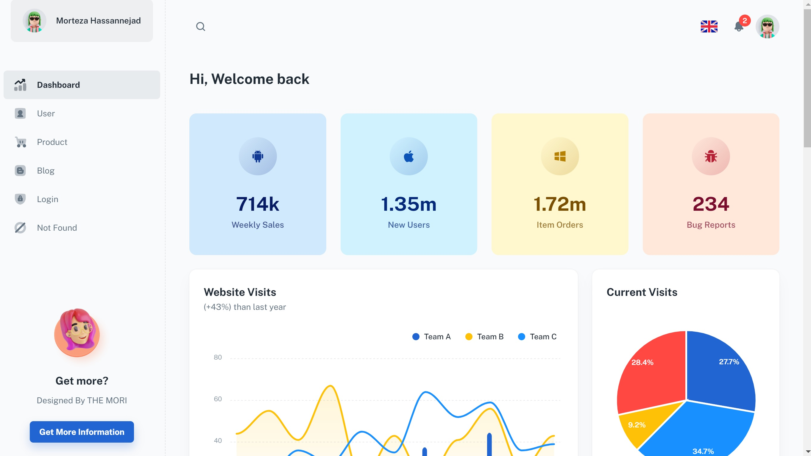

## create-react-app mui figma vercel

> React Admin Dashboard made with Figma, Material-UI components and React.

## Page demo

- [Dashboard](https://react-figma-mui-vercel.vercel.app/dashboard/app)
- [Users](https://react-figma-mui-vercel.vercel.app/dashboard/user)
- [Product](https://react-figma-mui-vercel.vercel.app/dashboard/products)
- [Blog](https://react-figma-mui-vercel.vercel.app/dashboard/blog)
- [Login](https://react-figma-mui-vercel.vercel.app/login)
- [Not Found](https://react-figma-mui-vercel.vercel.app/404)

## Getting started

- Recommended `node js 16.x` and `npm 6+`. (suggestion v16.15.0)
- Install dependencies: `npm install` / `yarn install`
- Start the project: `npm run start` / `yarn start`

## License

Distributed under the MIT License. See [LICENSE](https://github.com/themori/pure-react-mui-figma-vercel/blob/main/LICENSE.md) for more information.

## Contact us

Email Us: morteza.hassannezhad@gmail.com

# react-figma-mui-vercel
